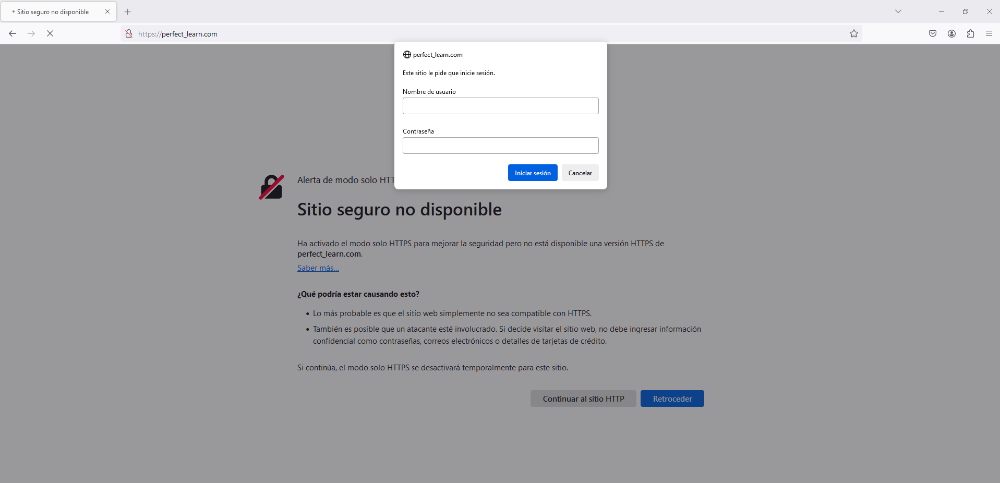
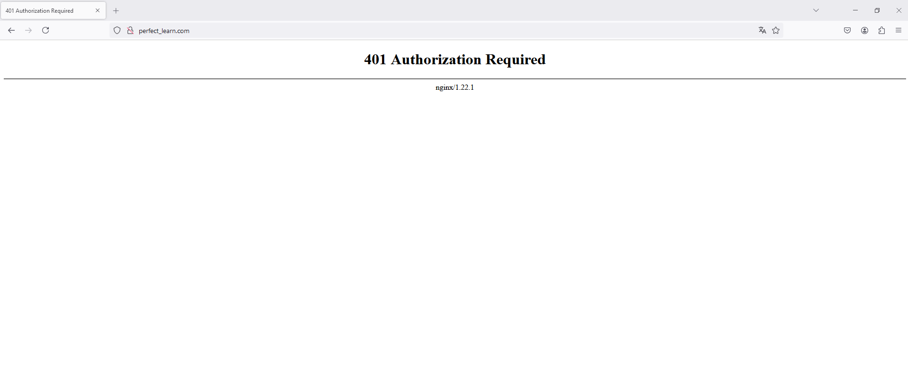

# Servidor Web con Nginx
### Práctica: Instalación y configuración de servidor web Nginx

<br>

## Contenidos
- [FTP](#ftp)
- [Conectar mediant FTPES y transferir archivos](#conectar-mediant-ftpes-y-transferir-archivos)
- [Cuestiones finales](#cuestiones-finales)
- [Autentificación](#autentificación)

<br>

### Nota:
Al ejecutar `vagrant up` con el Vagrantfile que se está suministrando en este repositorio, se llevarán a cabo sólamente las dos primeras provisiones, obviando la provisión con name "foo_fighters", ya que el servidor se está creando y no tiene aun el contenido de dicha web, que tendrá que ser transferido posteriormente mediante conexión FTPES.

Una vez transferido el contenido del sitio web al servidor, se podrá ejecutar esa provisión específica:

        vagrant provision --provision-with nombreProvision

<br>

## FTP

Tras instalar y configurar Nginx, como se puede ver en Vagrantfile, se sigue con los siguientes pasos:

1. Al no tener dns, se asocia la dirección IP a la web en el host Windows.  
    Se edita el archivo /etc/hosts para que asocie la IP de la máquina virtual a nginx_server.  
    En Windows está en el siguiente directorio:  
    `C:\Windows\System32\drivers\etc\hosts`  
    Se añade la línea:  
    `192.168.0.2 nginx_server`  
    Una vez hecho esto, se puede comprobar que las peticiones se están realizando correctamente accediendo los archivos de logs:  
    `/var/log/nginx/access.log`  
    `/var/log/nginx/error.log`

2. Instalar vsftpd. Se pedirán los siguientes datos:  

        If you enter '.', the field will be left blank.  
        -----  
        Country Name (2 letter code) [AU]:  
        State or Province Name (full name) [Some-State]:  
        Locality Name (eg, city) []:  
        Organization Name (eg, company) [Internet Widgits Pty Ltd]:  
        Organizational Unit Name (eg, section) []:  
        Common Name (e.g. server FQDN or YOUR name) []:  

3. Crear certificados de seguridad:

        sudo openssl req -x509 -nodes -days 365 -newkey rsa:2048 -keyout /etc/ssl/private/vsftpd.key -out /etc/ssl/certs/vsftpd.crt

- En la provisión de Vagrantfile, al comando se le añade el parámetro `-subj "/C=ES/ST=./L=./O=./OU=./CN=nginx_server/emailAddress=.` para proporcionar todos los datos y evitar que el comando sea interactivo.

4. En /etc/vsftpd.conf:
    - Borrar líneas:  

            rsa_cert_file=/etc/ssl/certs/ssl-cert-snakeoil.pem
            rsa_private_key_file=/etc/ssl/private/ssl-cert-snakeoil.key
            ssl_enable=NO

    - En su lugar añadir líneas:  

            rsa_cert_file=/etc/ssl/certs/vsftpd.crt
            rsa_private_key_file=/etc/ssl/private/vsftpd.key
            ssl_enable=YES
            allow_anon_ssl=NO
            force_local_data_ssl=YES
            force_local_logins_ssl=YES
            ssl_tlsv1=YES
            ssl_sslv2=NO
            ssl_sslv3=NO
            require_ssl_reuse=NO
            ssl_ciphers=HIGH

            local_root=/home/vagrant/ftp
    
    - También se deberá descomentar la siguiente línea para permitir la escritura y así poder transferir archivos mediante FTPES con WinSCP:

            write_enable=YES

5. Verificar que las rutas del certificado y la clave privada sean correctas:

        ls -l /etc/ssl/certs/vsftpd.crt /etc/ssl/private/vsftpd.key

6. Es posible que haya que ajustar los permisos para acceder a la clave privada:

        sudo chmod 755 /etc/ssl/private

7. Reiniciar el servicio:

        sudo systemctl restart vsftpd

8. Comprobar que está funcionando correctamente:
    
        sudo systemctl status vsftpd

<br>

## Conectar mediant FTPES y transferir archivos

En este caso se ha utilizado el programa <a href="https://winscp.net/eng/download.php">WinSCP</a>.

Para poder conectar se requiere una contraseña de usuario, la cual no tenemos si estamos en una máquina vagrant. Por ello se debe crear y asignar una nueva contraseña al usuario vagrant con `sudo passwd vagrant`.

En este caso, la asignación de la nueva contraseña al usuario vagrant se ha realizado en una provisión específica en Vagrantfile:

        config.vm.provision "shell", name: "set_password", inline: <<-SHELL
                echo "vagrant:vagrant" | sudo chpasswd
        SHELL


<br>

Tras conectar, se transfieren los archivos de nuestro sitio web al directorio ftp del servidor:


<br>

## Configuración del nuevo dominio y sitio web

De vuelta al servidor, primeramente se debe se eliminar el enlace simbólico de cualquier otra web en sites-enabled:  
    `sudo rm /etc/nginx/sites-enabled/nginx_server`

Tras esto, se vuelven a realizar todos los pasos que se han llevado a cabo inicialmente (en Vagrantfile), pero esta vez, para configurar el nuevo dominio del sitio web que se ha transferido:

    sudo mkdir -p /var/www/foo_fighters/html

    sudo cp -r /home/vagrant/ftp/* /var/www/foo_fighters/html

    sudo chown -R www-data:www-data /var/www/foo_fighters/html

    sudo chmod -R 755 /var/www/foo_fighters

    sudo nano /etc/nginx/sites-available/foo_fighters

        server {
            listen 80;
            listen [::]:80;
            root /var/www/foo_fighters/html;
            index index.html index.htm index.nginx-debian.html;
            server_name foo_fighters;
            location / {
                try_files $uri $uri/ =404;
            }
        }

    sudo ln -s /etc/nginx/sites-available/foo_fighters /etc/nginx/sites-enabled/

    sudo systemctl restart nginx

<br>

Se vuelve a editar el archivo /etc/hosts para que asocie la IP de la máquina virtual a nginx_server.  
    En Windows está en el siguiente directorio:  
    `C:\Windows\System32\drivers\etc\hosts`  
    Se cambia la asociación inicial:  
    `192.168.0.2 foo_fighters.es`

<br>

Resultado final:


<br>


## Cuestiones finales

**¿Qué pasa si no hago el link simbólico entre sites-available y sites-enabled de mi sitio web?**

Nginx solo carga y utiliza las configuraciones de los sitios que están en sites-enabled.

Si no se crea el enlace simbólico, Nginx no accederá a la configuración del sitio web en sites-enabled, por lo que este no estará disponible en el servidor. La web no se cargará, y cualquier intento de acceso devolverá un error o será redirigido a la dirección por defecto que viene indicada por el archivo "default", si es que sigue activo.

Es como si el archivo de configuración del sitio no existiera para Nginx.

**¿Qué pasa si no le doy los permisos adecuados a /var/www/nombre_web?**

Nginx no podrá leer los archivos o directorios necesarios para servir el contenido de la web.

Por un lado, son necesarios permisos de lectura para el usuario www-data. Si no tiene permisos de lectura, Nginx no podrá acceder al contenido y devolverá un error al intentar acceder a la web. Como solución, hay que asegurarse de que el propietario y el grupo sean www-data.

Por otro lado, también son necesarios permisos de ejecución (x) en directorios, ya que si estos permisos faltan, Nginx no podrá navegar por los directorios y no encontrará los archivos de la web. Para evitar estos problemas, normalmente se establecen permisos 755 para los directorios.


## Autentificación

`dpkg -l | grep openssl`

```bash
sudo sh -c "echo -n 'nombre:' >> /etc/nginx/.htpasswd"

sudo sh -c "openssl passwd -apr1 >> /etc/nginx/.htpasswd"

cat /etc/nginx/.htpasswd
```

`sudo nano /etc/nginx/sites-available/perfect_learn`

```bash
server {
        listen 80;
        listen [::]:80;
        root /var/www/perfect_learn/html;
        index index.html index.htm index.nginx-debian.html;
        server_name perfect_learn;
        location / {
                auth_basic "Área restringida";
                auth_basic_user_file /etc/nginx/.htpasswd;
                try_files $uri $uri/ =404;
        }
}
```

`cat /etc/nginx/sites-available/perfect_learn`

`sudo systemctl restart nginx`

Se vuelve a editar el archivo /etc/hosts para que asocie la IP de la máquina virtual a nginx_server.  
    En Windows está en el siguiente directorio:  
    `C:\Windows\System32\drivers\etc\hosts`  
    Se cambia la asociación inicial:  
    `192.168.0.2 perfect_learn.com`



<br>


<br>

Si se introducen mal las credenciales, volverá a pedirlas.  
Si se cancela la autentificación, muestra el error `401 Authorization Required`.



<br>

#### Ficheros error.log y access.log

En `error.log` quedan registrados los accesos erróneos junto a la causa, como *user not found* o *password mismatch*, y demás información.  
En `access.log` se registran todos los accesos, tanto erróneos como exitosos, junto a un código numérico.
- *200* para accesos exitosos.
- *401* para intentos fallidos.


#### Acceso restringido a la sección Contact

Se vuelve a editar el archivo *perfect_learn* de *sites-available*.

```bash
server {
	listen 80;
	listen [::]:80;
	root /var/www/perfect_learn/html/perfect_learn;
	index index.html index.htm index.nginx-debian.html;
	server_name perfect_learn;
	location / {
		try_files $uri $uri/ =404;
	}
	location = /contact.html {
		auth_basic "Área restringida";
		auth_basic_user_file /etc/nginx/.htpasswd;
	}
}
```

